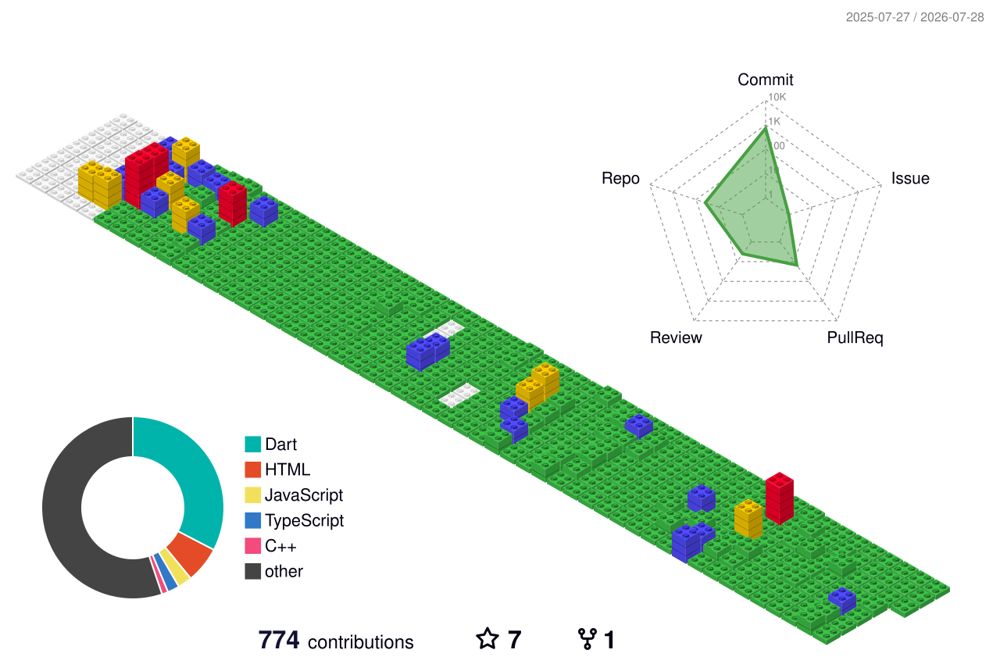

<!-- Profile README for Kidpech-code -->

<p align="center">
  
</p>

<p align="center">
  
</p>

<p align="center">
  <a href="https://pub.dev/publishers/kidpech.app/packages">
    
  </a>
  <a href="https://linkedin.com/in/kidpech-pianpithak">
    
  </a>
  <a href="mailto:kidpechpianpithak@kidpech.app">
    
  </a>
</p>

<p align="center">
  <a href="#about-me">About</a> ·
  <a href="#tech-stack">Tech Stack</a> ·
  <a href="#published-packages">Packages</a> ·
  <a href="#github-activity">Activity</a> ·
  <a href="#connect-with-me">Connect</a>
</p>

---

<a id="about-me"></a>

## 👋 About Me

I'm **Kidpech Pianpithak**, an application developer who enjoys turning real-world problems into clean, reliable, and useful software.

I work across **mobile apps, backend APIs, automation, and developer tools** — with a strong focus on practical products that people can actually use, not just shiny demos that look good for five minutes and then explode quietly in production.

- 💙 I care about software that is useful, ethical, and easy to maintain
- 📱 Building with **Flutter / Dart** for mobile and web experiences
- ⚙️ Exploring **Go**, backend systems, APIs, Railway, Linux, and deployment workflows
- 🧰 Interested in open-source tools, Thai developer utilities, security awareness, and automation
- 🚀 Always learning, improving, and shipping better work one commit at a time

---

## 🧭 What I Focus On

<table>
  <tr>
    <td width="50%" valign="top">
      <h3>📱 Application Development</h3>
      <p>Flutter apps, web apps, UX-focused flows, localization, authentication, maps, and production-ready mobile features.</p>
    </td>
    <td width="50%" valign="top">
      <h3>⚙️ Backend & APIs</h3>
      <p>Go APIs, API design, database workflows, Redis, PostgreSQL/PostGIS, deployment, monitoring, and reliability.</p>
    </td>
  </tr>
  <tr>
    <td width="50%" valign="top">
      <h3>🛠 Developer Tools</h3>
      <p>Packages, CLI workflows, automation, debugging utilities, and tools that reduce repeated manual work.</p>
    </td>
    <td width="50%" valign="top">
      <h3>🔐 Useful Public Projects</h3>
      <p>Projects around security awareness, scam prevention, public APIs, and tools that help Thai users and developers.</p>
    </td>
  </tr>
</table>

---

<a id="tech-stack"></a>

## 🛠 Tech Stack

<p align="center">
  <a href="https://skillicons.dev">
    
  </a>
</p>

<p align="center">
  <a href="https://skillicons.dev">
    
  </a>
</p>

<p align="center">
  
  
  
  
</p>

---

<a id="published-packages"></a>

## 📦 Published Packages

<p align="center">
  <a href="https://pub.dev/publishers/kidpech.app/packages">
    
  </a>
</p>

> I enjoy building reusable packages and tools that make development faster, cleaner, and more enjoyable for other developers.

<table>
  <tr>
    <td width="50%" valign="top">
      <h3>🌏 <a href="https://pub.dev/packages/thai_address_plus">Thai Address Plus</a></h3>
      <p>Thai address search, autocomplete, and caching for Flutter applications.</p>
      <p><code>Flutter</code> <code>Geography</code></p>
    </td>
    <td width="50%" valign="top">
      <h3>🛡️ <a href="https://pub.dev/packages/screen_security">Screen Security</a></h3>
      <p>Best-effort screenshot and recording protection for Android and iOS.</p>
      <p><code>Flutter</code> <code>Privacy</code></p>
    </td>
  </tr>
  <tr>
    <td width="50%" valign="top">
      <h3>⚡ <a href="https://pub.dev/packages/dio_architect">Dio Architect</a></h3>
      <p>Configurable HTTP tooling built on Dio for structured application networking.</p>
      <p><code>Dart</code> <code>HTTP</code></p>
    </td>
    <td width="50%" valign="top">
      <h3>🧭 <a href="https://pub.dev/packages/route_architect">Route Architect</a></h3>
      <p>Flutter routing with async guards, deep-link handling, and navigation shells.</p>
      <p><code>Flutter</code> <code>Navigation</code></p>
    </td>
  </tr>
</table>

---

## 🚀 Current Direction

```text
Learning deeply. Building practically. Shipping responsibly.
```

- Strengthening backend architecture with **Go**
- Improving public API design and deployment workflows
- Building more useful Flutter packages and Thai developer tools
- Exploring AI-assisted development, Linux workflows, and automation
- Making software that stays maintainable after the excitement fades

---

<a id="github-activity"></a>

## 📊 GitHub Activity

<p align="center">
  
  
  
</p>

<p align="center">
  
  
</p>

<p align="center">
  
</p>

---

## 📈 Weekly Development Breakdown

<!--START_SECTION:waka-->


**🐱 My GitHub Data** 

> 📦 884.3 kB Used in GitHub's Storage 
 > 
> 🏆 371 Contributions in the Year 2026
 > 
> 🚫 Not Opted to Hire
 > 
> 📜 56 Public Repositories 
 > 
> 🔑 35 Private Repositories 
 > 
📅 **I'm Most Productive on Monday** 

```text
Monday                   2159 commits        ██████░░░░░░░░░░░░░░░░░░░   22.66 % 
Tuesday                  1627 commits        ████░░░░░░░░░░░░░░░░░░░░░   17.08 % 
Wednesday                1609 commits        ████░░░░░░░░░░░░░░░░░░░░░   16.89 % 
Thursday                 1473 commits        ████░░░░░░░░░░░░░░░░░░░░░   15.46 % 
Friday                   1366 commits        ████░░░░░░░░░░░░░░░░░░░░░   14.34 % 
Saturday                 605 commits         ██░░░░░░░░░░░░░░░░░░░░░░░   06.35 % 
Sunday                   689 commits         ██░░░░░░░░░░░░░░░░░░░░░░░   07.23 % 
```


📊 **This Week I Spent My Time On** 

```text
💬 Programming Languages: 
Dart                     17 hrs 37 mins      ████████████████░░░░░░░░░   64.51 % 
Markdown                 5 hrs 53 mins       █████░░░░░░░░░░░░░░░░░░░░   21.60 % 
Other                    50 mins             █░░░░░░░░░░░░░░░░░░░░░░░░   03.11 % 
Go                       42 mins             █░░░░░░░░░░░░░░░░░░░░░░░░   02.62 % 
JSON                     36 mins             █░░░░░░░░░░░░░░░░░░░░░░░░   02.20 % 

🔥 Editors: 
VS Code                  20 hrs 21 mins      ███████████████████░░░░░░   74.53 % 
Claude Code              5 hrs 34 mins       █████░░░░░░░░░░░░░░░░░░░░   20.43 % 
Codex CLI                1 hr 22 mins        █░░░░░░░░░░░░░░░░░░░░░░░░   05.04 % 
```

**Timeline**


 Last Updated on 25/06/2026 01:21:10 UTC
<!--END_SECTION:waka-->

---

## 🐍 Contribution Snake

<p align="center">
  
</p>

---

## 🌐 3D Contribution Graph

<p align="center">
  
</p>

---

## 🎧 Spotify — Now Playing

<p align="center">
  <a href="https://spotify-github-profile.kittinanx.com/api/view?uid=31liv26i7k4ndonsnjj346vimroa&redirect=true">
    
  </a>
</p>

---

<a id="connect-with-me"></a>

## 🤝 Connect With Me

<p align="center">
  <a href="https://linkedin.com/in/kidpech-pianpithak" target="blank">
    
  </a>
  <a href="https://www.facebook.com/profile.php?id=61579747685241&locale=th_TH" target="blank">
    
  </a>
  <a href="mailto:kidpechpianpithak@kidpech.app" target="blank">
    
  </a>
</p>

<p align="center">
  <strong>Build with care. Ship with purpose. Keep learning.</strong>
</p>

<p align="center">
  <sub>Last profile refresh: 2026-08-05 UTC</sub>
</p>

<p align="center">
  
</p>
